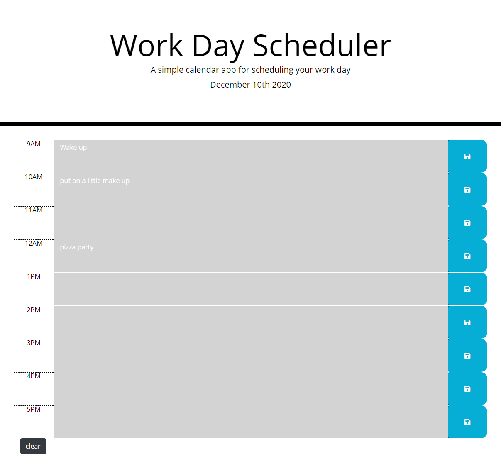

# Day Planner
- This is a working day planner that allows you to log, save, and clear your activities for each day. This app uses momoent.js to give it's user the current date and the time blocks change color to inform the user what blocks have passed (gray), what block it presently is (red), and what future blocks are still left (green).

## Table of contents
- [General Info](#general-info)
- [Link to deployed page](#link-to-deployed-page)
- [Day Planner Image](#day-planner-image)
- [Technologies](#technologies)
- [Summary](#summary)
- [Author](#author)

## General Info
-This application meets the following criteria:

```
GIVEN I am using a daily planner to create a schedule
WHEN I open the planner
THEN the current day is displayed at the top of the calendar
WHEN I scroll down
THEN I am presented with time blocks for standard business hours
WHEN I view the time blocks for that day
THEN each time block is color-coded to indicate whether it is in the past, present, or future
WHEN I click into a time block
THEN I can enter an event
WHEN I click the save button for that time block
THEN the text for that event is saved in local storage
WHEN I refresh the page
THEN the saved events persist
```

## Link to deployed page
- https://joshrehanek.github.io/day-planner/

## Day Planner Image


## Technologies
- [HTML](https://html.com/)
- [CSS](https://www.w3.org/Style/CSS/Overview.en.html)
- [Javascript](https://javascript.com/)

## Summary

- This is a working day planner that allows you to log, save, and clear your activities for each day. This app uses momoent.js to give it's user the current date and the time blocks change color to inform the user what blocks have passed (gray), what block it presently is (red), and what future blocks are still left (green).

## Author
-Joshua Azzam Rehanek